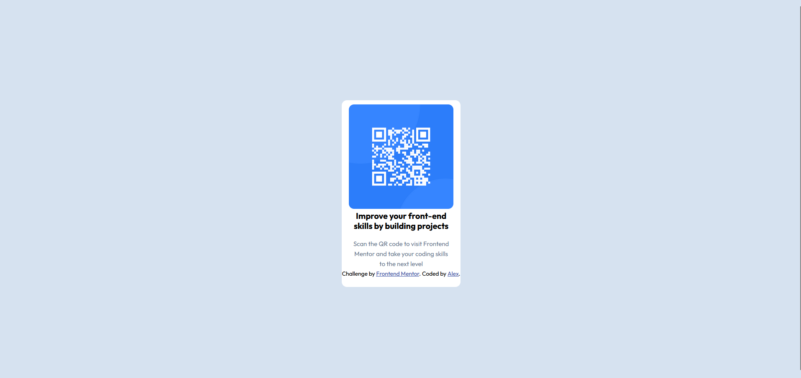
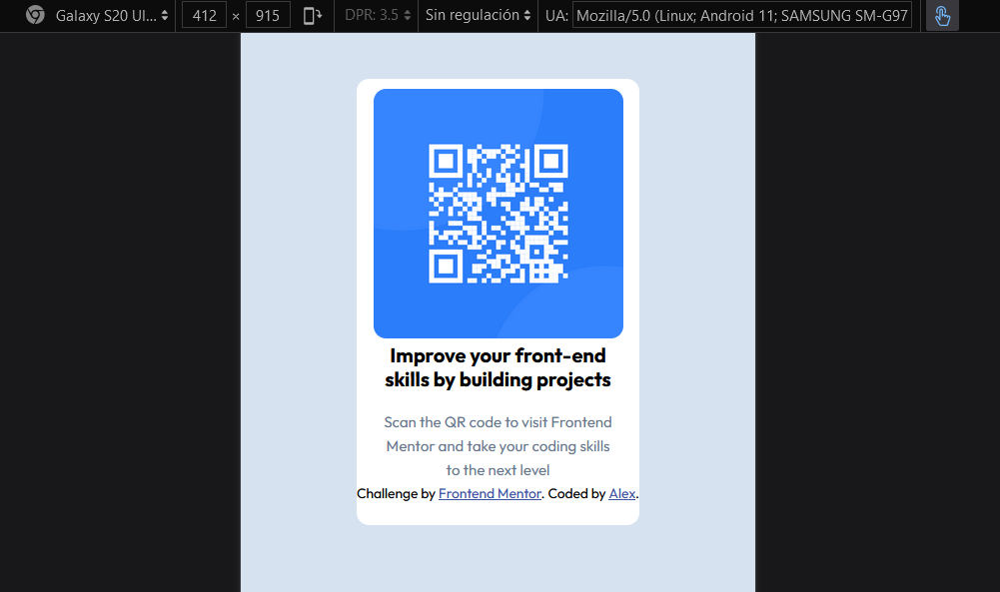

# Frontend Mentor - QR code component solution

This is a solution to the [QR code component challenge on Frontend Mentor](https://www.frontendmentor.io/challenges/qr-code-component-iux_sIO_H). Frontend Mentor challenges help you improve your coding skills by building realistic projects. 

## Table of contents

- [Overview](#overview)
  - [Screenshot](#screenshot)
  - [Built with](#built-with)
  - [What I learned](#what-i-learned)
  - [Continued development](#continued-development)
  - [Useful resources](#useful-resources)
- [Author](#author)

## Overview
Simple solution to the Frontend Mentor QR challenge without using media queries 

### Screenshot

### Built with

- Semantic HTML5 markup
- CSS custom properties
- Flexbox
- Mobile-first workflow
- [Styled Components](https://styled-components.com/) - For styles

### What I learned

I loved learning how useful it is to put max widths or margins to certain elements can help in creating a good design for the website without having to add extra code that isn't necessary. I'm really proud of myself for not looking at any tutorials in order to solve this challenge. 

### Continued development

I want to learn how to make good responsive sites with clean code, so I want to improve a lot my CSS skills in this aspect

### Useful resources

- [Example resource 1](https://dev.to/ibn_abubakre/responsive-css-width-2jnm) - This helped me understand better how to create responsive widths and heights without the use of media queries.

## Author

- GitHub - [@aztromel] https://github.com/aztromel

